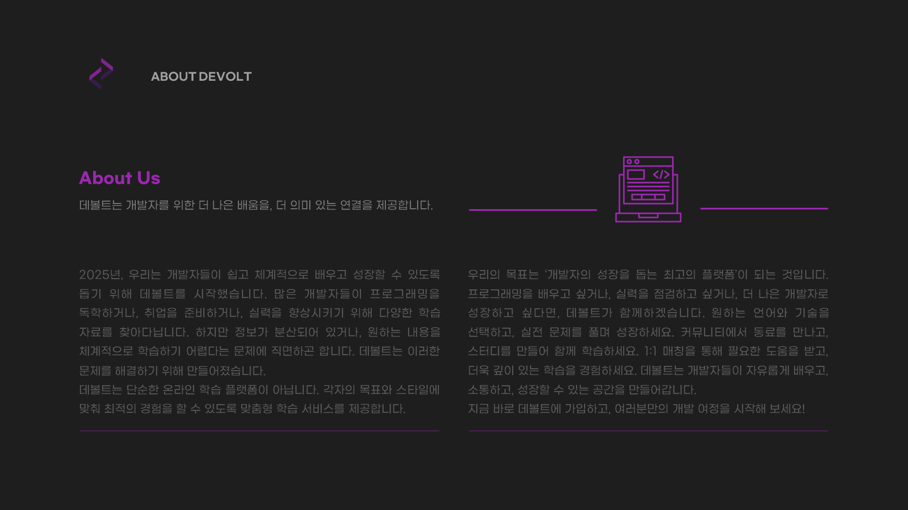

 

<h2>🛠️ Tech Stack</h2>

 
   
   
   
  
   
   
   
   
   
  
   
  
  
  
   
  
   
  
  
  
   
  
   
   
   
   
   

   
   
  
   
  
   
   
   

  
   
   
   
  
   

<h2>✨ Features</h2>

### 프로그래밍 학습
- 다양한 프로그래밍 언어(C, C++, Java, JavaScript, Python) 이론 학습
- 예제 코드 기반 실습 환경 제공
- 학습 진도율 추적 및 관리

### 코딩 테스트
- 실제 IDE와 유사한 코드 에디터 환경 제공
- 다양한 언어 지원 (Java, C, C++, Python, NodeJS)
- 컴파일/런타임 에러, 메모리 제한 초과 등 상세 피드백
- 난이도별 문제 제공 및 진도 관리

### 정보처리기사 대비
- 기출 및 모의고사 문제 풀이 환경
- 단원별 학습 자료 제공

### 개발자 커뮤니티
- 개발자 중심 게시판 (질문/취업/진로/스터디)
- 멘토링 매칭 서비스
- 유사도 기반 게시글 추천 시스템
- 팀 프로젝트 모집 지원

### 개발자 리소스
- 개발 분야별 로드맵 제공
- IT 용어 사전 및 개발 도구 모음
- 외부 코딩 테스트 사이트 정보
